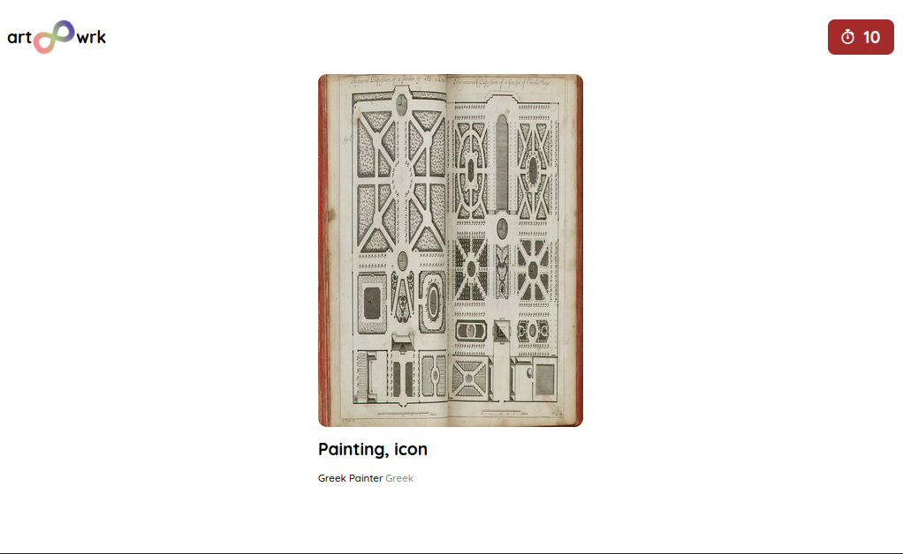
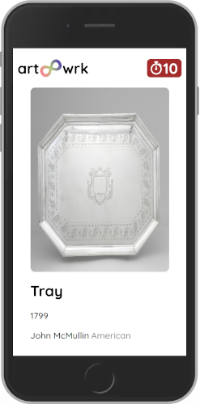

# **Museum as you know it as a facebook story**

## **Desktop**  


## **Mobile**  


# Run  
```
$ npm start
```

Open [http://localhost:3000]() and enjoy!

Made with 🖤 by [thejohnjohn](https://github.com/thejohnjohn)